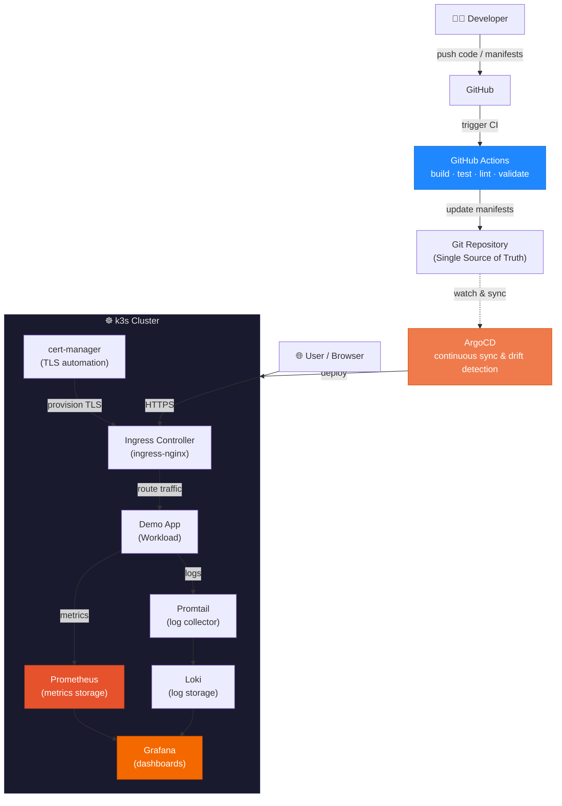
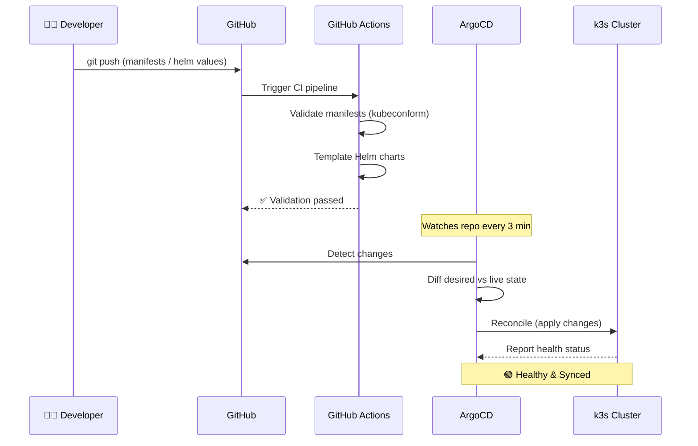
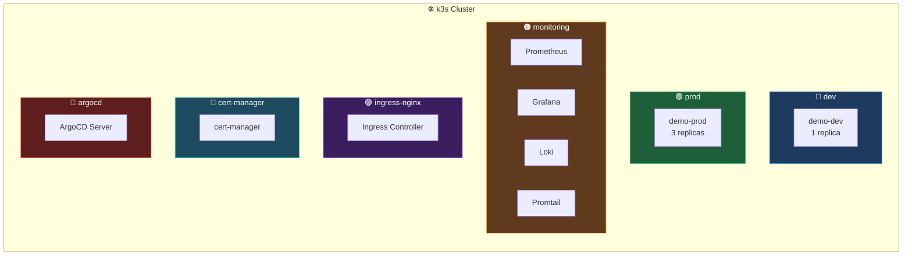
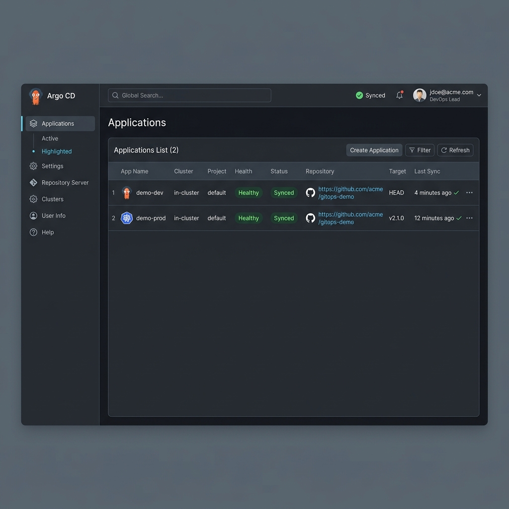
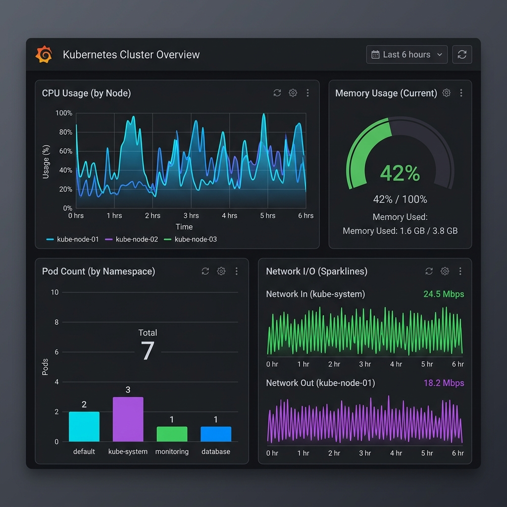
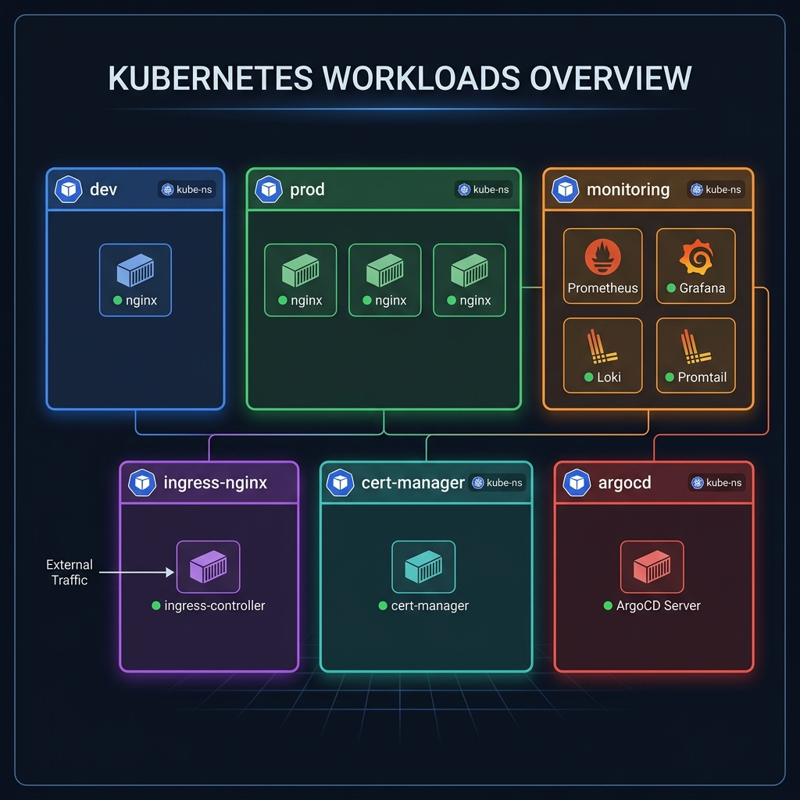

<](https://github.com/lexx/k8s-lab/actions)


</div>

---

## 🎯 What Is This Project?

This repository is a **fully functional, production-style Kubernetes platform** running on [k3s](https://k3s.io/) inside WSL Ubuntu. It demonstrates how to build and operate a real-world cloud-native platform from scratch — not just deploy an app, but wire together the entire ecosystem that supports it:

- **GitOps-driven deployments** — code changes automatically flow from Git to the cluster
- **Full observability stack** — metrics, dashboards, and centralized logging out of the box
- **Multi-environment management** — dev and prod namespaces with isolated configs
- **Automated TLS** — certificates provisioned and rotated without manual intervention
- **CI validation** — every push is validated against Kubernetes schemas before it reaches the cluster

### Why This Project Matters

| Challenge | How This Lab Solves It |
|---|---|
| Manual deployments are error-prone | ArgoCD automatically reconciles cluster state with Git |
| "Works on my machine" problems | GitHub Actions validates manifests before merge |
| No visibility into cluster health | Prometheus + Grafana + Loki provide full observability |
| TLS certificate management overhead | cert-manager automates certificate lifecycle |
| Environment configuration drift | Kustomize overlays enforce per-environment isolation |
| Complex tooling requires deep expertise | This repo is a working reference you can study and fork |

---

## 🏗️ Architecture


### Architecture Diagram (Mermaid)



---

## 🔄 GitOps Flow

The entire deployment lifecycle is driven by Git — no `kubectl apply` required.



### Flow in Detail

1. **Developer** modifies Helm values, Kustomize overlays, or raw manifests
2. **`git push`** triggers GitHub Actions CI pipeline
3. **GitHub Actions** validates all manifests with `kubeconform` and templates Helm charts
4. **ArgoCD** detects changes in the repo and computes the diff
5. **Cluster** is automatically reconciled — zero manual intervention
6. **Observability stack** captures metrics and logs from the new deployment

---

## 🗂️ Namespace Architecture

Each concern is isolated in its own namespace for security, resource management, and clarity.



| Namespace | Purpose | Key Workloads |
|---|---|---|
| `dev` | Development environment | demo-dev (1 replica) |
| `prod` | Production environment | demo-prod (3 replicas) |
| `monitoring` | Observability stack | Prometheus, Grafana, Loki, Promtail |
| `ingress-nginx` | External traffic routing | NGINX Ingress Controller |
| `cert-manager` | TLS certificate automation | cert-manager + ClusterIssuer |
| `argocd` | GitOps controller | ArgoCD Server, Repo Server, App Controller |

---

## 📸 Screenshots

### ArgoCD — GitOps Dashboard

All applications managed declaratively with full sync and health visibility.



### Grafana — Cluster Monitoring

Real-time metrics, resource utilization, and pod health at a glance.



### Workloads — Namespace Overview

Visual breakdown of all running workloads across cluster namespaces.



---

## 📂 Repository Structure

```text
k8s-lab/
├── .github/
│   └── workflows/
│       └── k8s-validate.yml        # CI: manifest validation with kubeconform
│
├── apps/                            # ArgoCD Application manifests (planned)
│
├── charts/
│   └── demo-app/                    # Helm chart for the demo workload
│       ├── Chart.yaml
│       ├── values.yaml              # Default values (3 replicas, nginx:stable)
│       └── templates/
│           ├── deployment.yaml      # Deployment with templated image & replicas
│           ├── service.yaml         # ClusterIP service on port 80
│           └── ingress.yaml         # Ingress with TLS via cert-manager
│
├── overlays/                        # Kustomize per-environment overrides
│   ├── dev/
│   │   ├── kustomization.yaml       # dev namespace, 1 replica
│   │   └── values.yaml
│   └── prod/
│       ├── kustomization.yaml       # prod namespace, 3 replicas
│       └── values.yaml
│
├── cert-manager/
│   └── issuer.yaml                  # ClusterIssuer (self-signed)
│
├── ingress/                         # Ingress controller configuration (planned)
│
├── docs/                            # Architecture diagrams & screenshots
│   ├── architecture.png
│   ├── argocd-dashboard.png
│   ├── grafana-dashboard.png
│   └── workloads-overview.png
│
├── install.yaml                     # ArgoCD installation manifest
└── README.md
```

---

## 🛠️ Tech Stack

| Layer | Tool | Purpose |
|---|---|---|
| **Runtime** | k3s (on WSL Ubuntu) | Lightweight Kubernetes distribution |
| **GitOps** | ArgoCD | Declarative continuous delivery |
| **CI** | GitHub Actions | Manifest validation before deployment |
| **Ingress** | ingress-nginx | External traffic routing & load balancing |
| **TLS** | cert-manager | Automated certificate provisioning |
| **Packaging** | Helm | Templated Kubernetes manifests |
| **Overlays** | Kustomize | Per-environment configuration |
| **Metrics** | Prometheus | Time-series metrics collection |
| **Dashboards** | Grafana | Visualization & alerting |
| **Logs** | Loki + Promtail | Centralized log aggregation |

---

## 🚀 Quick Start

### Prerequisites

- WSL 2 with Ubuntu
- k3s installed (`curl -sfL https://get.k3s.io | sh -`)
- Helm 3
- kubectl

### 1. Install ArgoCD

```bash
kubectl create namespace argocd
kubectl apply -n argocd -f install.yaml
```

### 2. Deploy cert-manager Issuer

```bash
kubectl apply -f cert-manager/issuer.yaml
```

### 3. Deploy Applications via Kustomize

```bash
# Dev environment
kubectl apply -k overlays/dev/

# Prod environment
kubectl apply -k overlays/prod/
```

### 4. Access Dashboards

```bash
# ArgoCD UI
kubectl port-forward svc/argocd-server -n argocd 8080:443

# Grafana
kubectl port-forward svc/grafana -n monitoring 3000:80
```

---

## 📘 Lessons Learned

Building this platform from scratch revealed important insights that textbooks and tutorials often skip.

### 1. ⚡ Traefik vs ingress-nginx Port Conflict

> **Problem:** k3s ships with Traefik as the default ingress controller, which immediately binds to ports 80 and 443. When deploying `ingress-nginx` alongside it, the load balancer pods were stuck in `Pending` — both controllers competed for the same host ports.
>
> **Resolution:** Disabled Traefik's LoadBalancer service via `HelmChartConfig`, freeing ports 80/443 for ingress-nginx. ArgoCD health status transitioned to `Healthy` immediately after.
>
> **Takeaway:** Always check what k3s bundles by default before deploying your own components. The `--disable=traefik` flag at install time is the cleanest approach.

### 2. 🔄 GitOps Is a Discipline, Not Just a Tool

> Installing ArgoCD is the easy part. The real challenge is structuring your repo so that **every cluster change is a Git commit**. This means:
> - No ad-hoc `kubectl apply` — everything goes through Git
> - Helm values and Kustomize overlays must be the single source of truth
> - Debugging means checking Git history, not just cluster state
>
> **Takeaway:** GitOps pays off when the repo structure is well-organized. A messy repo makes ArgoCD harder to work with, not easier.

### 3. 📊 Observability Should Be Day-1, Not Day-N

> Deploying Prometheus + Grafana + Loki early in the project was one of the best decisions. When things broke (and they did), having metrics and logs immediately available saved hours of debugging.
>
> **Takeaway:** Don't wait until production to add monitoring. Deploy the observability stack before your first workload.

### 4. 🔒 Self-Signed TLS Is Good Enough for Learning

> Using cert-manager with a `selfSigned` ClusterIssuer gives you the full TLS automation experience — certificate creation, secret management, renewal — without needing a domain or DNS provider. The skills transfer directly to production with Let's Encrypt or Vault issuers.
>
> **Takeaway:** You don't need a real domain to learn certificate automation. The workflow is identical regardless of the issuer type.

### 5. 🧩 Kustomize + Helm = Best of Both Worlds

> Pure Helm requires maintaining separate `values.yaml` files and custom release scripts. Pure Kustomize struggles with complex templating. Combining them — using Kustomize to drive Helm renders with per-environment values — gives you:
> - Helm's powerful templating
> - Kustomize's clean overlay model
> - A single `kubectl apply -k` command per environment
>
> **Takeaway:** Don't pick one tool — use them together. The Kustomize `helmCharts` generator is underrated.

### 6. 🛡️ CI Validation Catches Real Errors

> Setting up `kubeconform` in GitHub Actions caught several issues before they reached the cluster:
> - Typos in resource kinds
> - Missing required fields
> - Invalid API versions
>
> **Takeaway:** Schema validation is cheap to set up and catches the most common deployment failures. Do it from day one.

---

## 🗺️ Roadmap

- [ ] Terraform-managed infrastructure layer
- [ ] External DNS for automatic DNS record management
- [ ] Let's Encrypt production TLS issuers
- [ ] Network policies for namespace isolation
- [ ] Sealed Secrets for GitOps-friendly secret management
- [ ] Multi-cluster ArgoCD ApplicationSets
- [ ] Alertmanager integration for Prometheus alerts
- [ ] Cost monitoring and resource quotas

---

## 📄 License

This project is for educational and portfolio purposes. Feel free to fork and adapt.

---

<div align="center">

**Built with ☸️ and 💪 as a hands-on Kubernetes learning platform**

</div>
]]>
