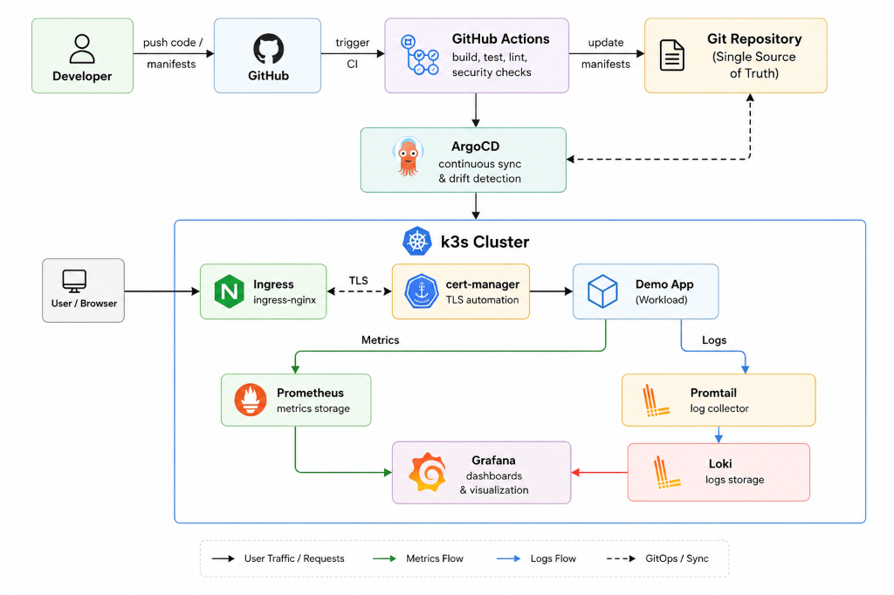

# Kubernetes Platform Lab

Production-style Kubernetes platform lab built on k3s inside WSL Ubuntu.

## Architecture



## Stack

- Kubernetes (k3s)
- ingress-nginx
- cert-manager
- Prometheus
- Grafana
- Loki
- Promtail
- GitHub Actions
- ArgoCD GitOps

---

# Architecture

GitHub
↓
GitHub Actions CI Validation
↓
ArgoCD GitOps
↓
Kubernetes Cluster (k3s)
↓
Applications + Ingress + TLS
↓
Prometheus / Grafana / Loki

---

# Features

## GitOps Deployments

Applications are deployed automatically via ArgoCD.

Workflow:

git push
↓
ArgoCD detects changes
↓
Cluster reconciles automatically

---

## Observability Stack

Metrics:
- Prometheus
- Grafana dashboards

Logs:
- Loki
- Promtail centralized logging

---

## TLS Automation

cert-manager automatically provisions TLS certificates for ingress resources.

---

# Repository Structure

```text
apps/
cert-manager/
monitoring/
.github/workflows/
```

# CI Validation

GitHub Actions validates Kubernetes manifests using kubeconform.

# Example Workflow

1. Modify deployment manifests
2. Commit changes
3. Push to GitHub
4. ArgoCD syncs cluster automatically
5. Metrics and logs visible in Grafana

# Screenshots To Add

- ArgoCD dashboard
- Grafana dashboards
- Loki logs
- GitHub Actions pipeline

# Future Improvements

- Helm charts
- Kustomize overlays
- Terraform infrastructure
- External DNS
- Real TLS issuers
- Multi-environment GitOps

# Operational Challenges

## Ingress Controller Port Conflict

k3s deploys Traefik by default, which occupied host ports 80/443.

Because ingress-nginx also required those ports, the ingress-nginx service load balancer pods were stuck in Pending state.

Resolution:
- Disabled Traefik LoadBalancer service via HelmChartConfig
- Freed host ports 80/443
- ingress-nginx acquired external IP successfully
- ArgoCD application health transitioned to Healthy

# trigger
